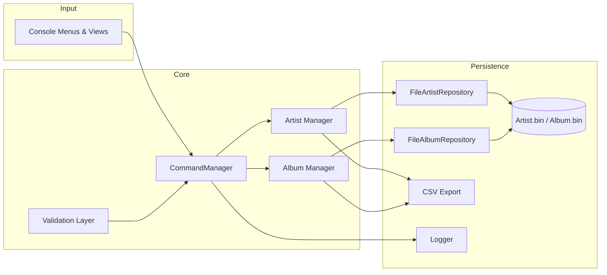

# Album Management System 🎵

<p align="center">
  <em>A feature-rich, modern C++ console experience for curating artists, albums, and archival metadata with zero compromise on data integrity.</em>
</p>

<p align="center">
  <a href="https://img.shields.io/badge/C%2B%2B-17-blue.svg"></a>
  <a href="https://img.shields.io/badge/license-MIT-success.svg"></a>
  <a href="https://img.shields.io/badge/platform-Windows%20%7C%20Linux%20%7C%20macOS-6f42c1.svg"></a>
  <a href="tasks.md"></a>
</p>

The Album Management System started life as a semester project and has grown into a showcase of modern C++ craftsmanship. It blends a fast, undo/redo-enabled command core with binary persistence, logging, CSV exports, and rich validation so you can manage a music archive with confidence.

---

## Table of Contents

1. [Highlights](#-highlights)
2. [Quick Start](#-quick-start)
3. [Guided Tour](#-guided-tour)
4. [Architecture Overview](#-architecture-overview)
5. [Data & Tooling](#-data--tooling)
6. [Quality Playbook](#-quality-playbook)
7. [Contribution Guide](#-contribution-guide)
8. [Roadmap](#-roadmap)
9. [License](#-license)

---

## ✨ Highlights

- **Full-stack artist & album management** – curate artists, attach rich album records (format, published date, asset path), and keep both views in sync.
- **Command-driven undo/redo** – every mutation is wrapped in the Command pattern, enabling instant rollback/redo with contextual descriptions.
- **Binary persistence + CSV export** – keep blazing-fast `.bin` stores for runtime and export to human-friendly CSV when you need to share data.
- **Snapshot backups & restores** – capture timestamped `.bin` snapshots and rewind the entire catalog safely.
- **Advanced search & analytics** – prefix search on IDs/names/titles, filter by date, and inspect collection statistics in seconds.
- **Robust validation pipeline** – guard rails on every input (names, phones, emails, formats, dates, paths) to keep your catalog clean.
- **Extensive logging** – the `album_system.log` trace captures every significant operation for audits and debugging sessions.

---

## 🚀 Quick Start

> **Prerequisites**
>
> - CMake ≥ 3.10
> - A C++17-compatible compiler (GCC, Clang, or MSVC)
> - Git (for version control and optional hooks)

### 1. Clone the repository

```bash
git clone https://github.com/LeulTew/Album-Management-System.git
cd Album-Management-System
```

### 2. Build the Application

#### Windows (Primary: Code::Blocks IDE)

This project is developed using Code::Blocks on Windows for its integrated development environment and ease of use.

1. Open `Album Management System 1.0.cbp` in Code::Blocks
2. Select **Build → Build** (or press Ctrl+F9)
3. The executable will be generated in `bin/Debug/` or `bin/Release/`

#### Alternative: CMake Build System (Cross-Platform)

For advanced users or other platforms:

##### Windows (PowerShell with MinGW or Visual Studio Build Tools)

```powershell
cmake -S . -B build -G "MinGW Makefiles"
cmake --build build --config Release
```

##### Linux / macOS

```bash
cmake -S . -B build
cmake --build build --config Release
```

The executable is placed at `build/album_management` (or `build/Release/album_management.exe` on Windows).

### 4. Seed sample data

Populate realistic demo records before exploring the UI:

```powershell
.\temp_populate.exe      # Pre-built helper (or build from temp_populate.cpp)
```

This creates `Artist.bin` and `Album.bin` with ready-to-browse content.

---

## 🧭 Guided Tour

Launch the executable to enter the colorized console dashboard:

```text
~~~~~~~~~~~~~~~~~~~~~~~~~~~~~~
            ALBUM MANAGEMENT
~~~~~~~~~~~~~~~~~~~~~~~~~~~~~~
 1 ▸ Artist Manager
 2 ▸ Album Manager
 3 ▸ Backup & Restore
 4 ▸ Statistics
 5 ▸ Undo (context aware)
 6 ▸ Redo (context aware)
 7 ▸ Exit (with final stats)

Choice: ▷
```

- **Artist Manager** – switch between viewer/editor modes, perform prefix search, and use undo/redo for safe experimentation.
- **Album Manager** – ingest albums per artist, track format + release date + asset path, and export curated lists.
- **Backup & Restore** – capture point-in-time snapshots and roll the entire archive backward or forward in seconds.
- **Statistics** – instant overview of collection size and album distribution per artist; exiting from the main menu presents a final summary automatically.

Undo/redo shortcuts surface in menus once actions are available, giving you confidence with every change.

---

## 🧱 Architecture Overview



- **Command Manager** – centralizes redo/undo stacks with descriptive history strings.
- **Managers + Views** – orchestrate user flows, keep indices ordered, and interact with binary files via repositories.
- **Repository Layer** – `FileArtistRepository` and `FileAlbumRepository` abstract persistence so future backends (SQLite, REST) can plug in.
- **Validation Layer** – dedicated validators ensure consistent casing, safe email/phone formats, and normalized paths.
- **Logging** – every important event is timestamped in `album_system.log` for traceability.

---

## 🗄️ Data & Tooling

| Artifact | Purpose |
| --- | --- |
| `Artist.bin` / `Album.bin` | Primary binary stores using fixed-width records for lightning-fast random access. |
| `album_system.log` | Chronological activity log (initialization, CRUD operations, repository failures). |
| `backups/` | Timestamped snapshots plus `index.csv` registry powering the restore menu. |
| `test_tasks.md` | Black-box manual test matrix capturing expected behaviors. |
| `temp_populate.cpp` & `temp_populate.exe` | Utility to scaffold sample data during development or demos. |
| `test_suite.ps1` / `run_tests.bat` | Lightweight smoke checks verifying builds, files, and repository state on Windows. |

Exports land alongside the executable as `artists.csv` and `albums.csv`, preserving UTF-8 formatting for spreadsheets.

---

## 🛡️ Quality Playbook

- **Validation-first mindset** – dedicated `validate*` helpers reject malformed names, emails, phone numbers, record formats, dates, and paths before they ever hit disk.
- **Logging & observability** – the singleton `Logger` tracks command execution, repository fallbacks, and IO anomalies.
- **Testing** – use `test_suite.ps1` or `run_tests.bat` for scripted regression checks; more granular Google Test suites are being introduced (see [Roadmap](#-roadmap)).
- **Manual QA** – follow `test_tasks.md` for exhaustive scenario coverage (searches, exports, statistics, persistence checks).

---

## 🤝 Contribution Guide

1. Fork the repository and sync with `master`.
2. Create a feature branch (`git checkout -b feature/my-awesome-improvement`).
3. Build with CMake and run the smoke suite.
4. Open a pull request detailing the change, tests, and any screenshots/logs.

> 💡 Tip: respect the undo/redo and repository abstractions when extending features so you inherit consistent behavior for free.

---

## 🛣️ Roadmap

The live improvement tracker lives in [`tasks.md`](tasks.md). Upcoming priorities include:

- Progress indicators for long-running file operations.
- Google Test integration plus file I/O integration harnesses.
- API & developer docs powered by Doxygen.
- GitHub Actions CI/CD pipeline and Docker packaging.
- Deep-dive hardening: sanitization, concurrency safety, IO buffering, checksums.

Join the journey—each milestone is engineered to level up this system toward a production-ready archival tool.

---

## 📄 License

Released under the [MIT License](LICENSE). Build something extraordinary with it.